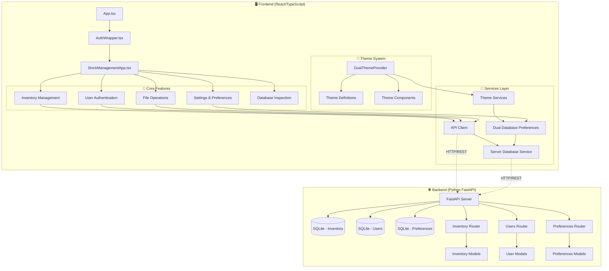
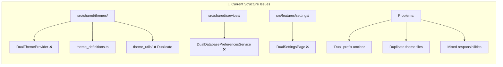
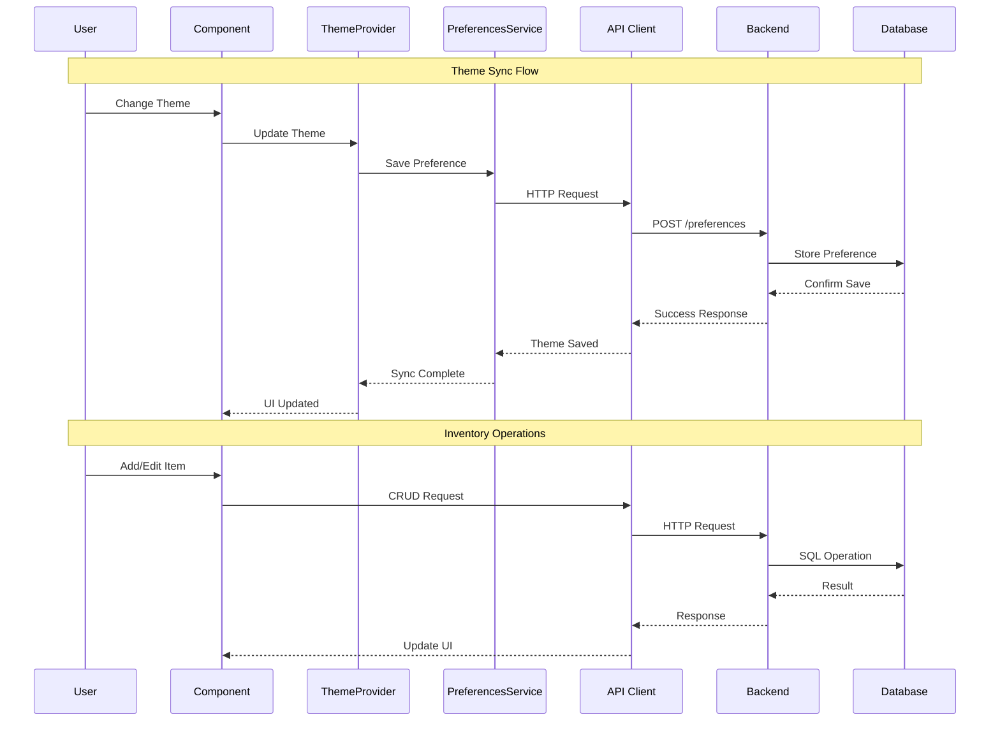
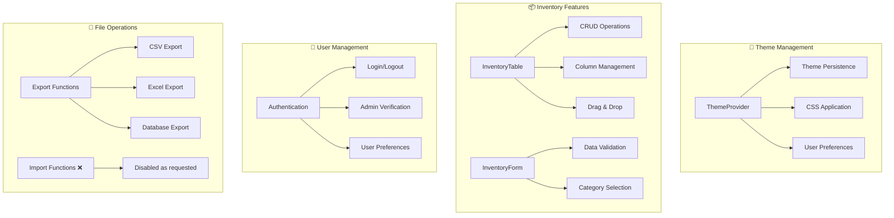
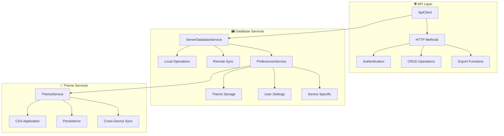

# PRSTOCKS Inventory Management - Architecture Documentation

## 📊 System Architecture Overview



## 🏗️ Directory Structure Analysis



## 🔄 Data Flow Architecture



## 🎯 Component Responsibilities



## 🔧 Service Architecture



## 🚨 Current Issues & Proposed Fixes

### Issue 1: Confusing "Dual" Naming
**Problem:** Files with "Dual" prefix are unclear
- `DualThemeProvider` → What makes it "dual"?
- `DualDatabasePreferencesService` → Confusing purpose
- `DualSettingsPage` → Redundant naming

**Solution:** Rename to be more descriptive:
- `DualThemeProvider` → `MultiDeviceThemeProvider`
- `DualDatabasePreferencesService` → `CrossDevicePreferencesService`
- `DualSettingsPage` → `DeviceSettingsPage`

### Issue 2: Duplicate Theme Files
**Problem:** 
- `/themes/theme_definitions.ts`
- `/themes/theme_utils/theme_definitions.ts`

**Solution:** Consolidate into single source of truth

### Issue 3: Mixed Service Responsibilities
**Problem:** Services mixing theme, preferences, and database concerns

**Solution:** Clear separation:
```
src/shared/
├── services/
│   ├── preferences/
│   │   ├── CrossDevicePreferencesService.ts
│   │   └── ThemePreferencesService.ts
│   ├── database/
│   │   └── ServerDatabaseService.ts
│   └── api/
│       └── ApiClient.ts
```

## 📱 Mobile Responsiveness Architecture

```mermaid
graph LR
    subgraph "📱 Responsive Design"
        MD[Media Queries] --> M1[@media max-width: 480px]
        MD --> M2[@media max-width: 768px]
        MD --> M3[@media max-width: 1024px]
        
        RD[Responsive Components] --> RD1[Fixed Header]
        RD --> RD2[Collapsible Navigation]
        RD --> RD3[Touch-Friendly Forms]
        RD --> RD4[Optimized Tables]
    end
```

## 🔮 Future Architecture Improvements

1. **Service Layer Refactoring**
   - Split monolithic services
   - Implement dependency injection
   - Add proper error boundaries

2. **State Management**
   - Consider Redux/Zustand for complex state
   - Implement proper data caching
   - Add optimistic updates

3. **Performance Optimization**
   - Implement code splitting
   - Add lazy loading for routes
   - Optimize bundle size

4. **Testing Strategy**
   - Unit tests for services
   - Integration tests for APIs
   - E2E tests for critical flows

---

*Generated: October 2, 2025*
*Last Updated: After mobile responsiveness and export/import fixes*